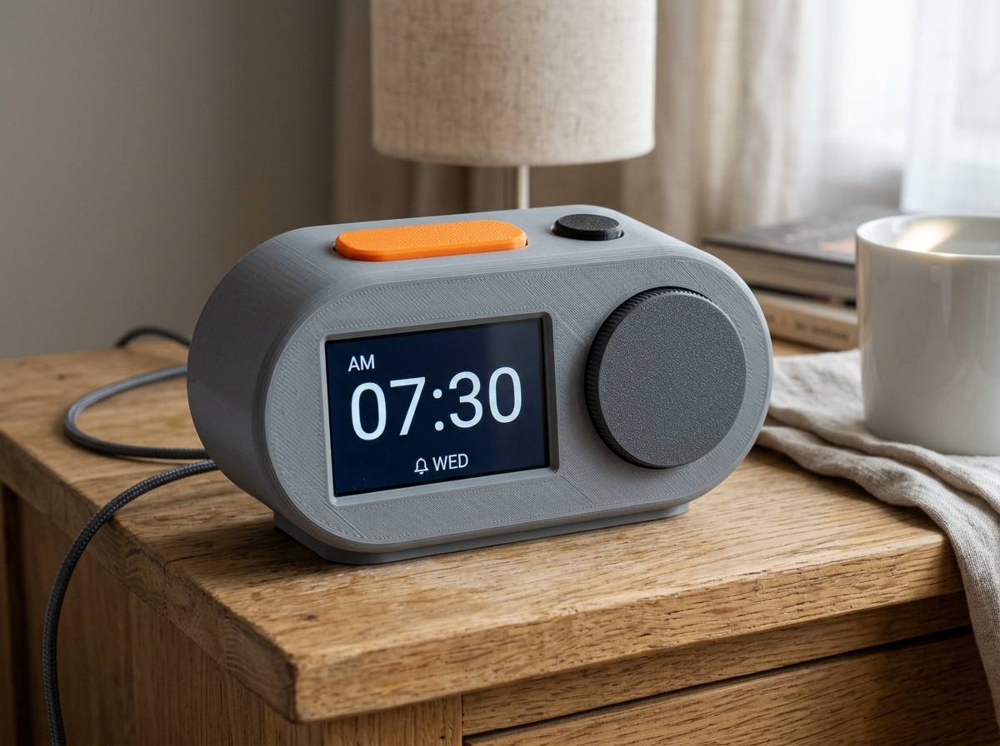

<p align="center">
  
</p>

A USB-powered ESP32-S3 bedside clock that keeps time and alarms offline, syncs user-approved schedules from a phone or PC, dims for sleep, and remains useful without internet.



## Overview

Dawn Dock sits between a basic alarm clock and a cloud-dependent smart display. Its core clock, alarm, snooze, brightness, and local setup functions work without an account or network. A companion app can transfer alarm schedules and calendar snapshots over the local network or BLE; optional weather and calendar refreshes are additive, never prerequisites for waking.

## Motivation

Traditional alarm clocks are dependable but tedious to configure. Smart displays are convenient but can depend on vendor accounts, internet services, microphones, and opaque data handling. Dawn Dock aims for a repairable middle path: physical controls, a calm night display, RTC-backed timekeeping, explicit sync, and documented offline behavior.

## Target users

- People who want a bedside clock without a cloud account or always-listening microphone.
- Shift workers, students, caregivers, and households with changing but non-critical routines.
- Makers who want an approachable ESP32-S3 and KiCad project with modular bring-up.
- Privacy-conscious users who want to own, inspect, back up, and export alarm data.

Dawn Dock is a convenience appliance, not a life-safety or medical device. Users must not rely on it for medication, emergency response, transportation safety, or any situation where a missed alarm could cause serious harm.

## Concrete use cases

1. Set recurring weekday alarms on the device with a rotary control and dedicated buttons.
2. Prepare a week of alarms on a phone or computer, review a diff, and explicitly sync it to the clock.
3. Import selected events from an `.ics` file and turn them into alarm suggestions that require confirmation.
4. Dim the screen manually or with an ambient-light rule while retaining a one-press brightness override.
5. Lose Wi-Fi overnight and still get the stored alarm from RTC-backed local state.
6. Export alarms, settings, and a redacted event snapshot as portable JSON.

## Intended workflow

1. Assemble the ESP32-S3 display module, low-voltage carrier board, controls, sensor, and enclosure.
2. Flash firmware over USB and complete first-run setup locally.
3. Set time from the companion app, USB serial, or network time; the RTC maintains time across normal power interruptions.
4. Create alarms on-device or in the companion app. Calendar-derived alarms are previews until accepted.
5. Review the device/app sync summary, transfer the schedule, and verify the next alarm on the clock face.
6. Use physical snooze, alarm-dismiss, brightness, and menu controls without opening the app.
7. Export or restore user-owned configuration when moving devices.

## MVP features

- RTC-backed local time, timezone, DST rules, and deterministic recurring alarms.
- 3.5-inch readable clock face with manual and ambient-light-aware dimming.
- Dedicated snooze and brightness controls plus a rotary menu control.
- Locally stored alarms with clear next-alarm and sync-state indicators.
- Local-only companion setup/sync, schedule preview, JSON backup, and `.ics` import.
- Versioned, authenticated local protocol with no required cloud account.
- Repeatable firmware/app builds and hardware-in-the-loop test points as the project matures.

## Non-goals

- No voice assistant, microphone monitoring, advertising, or remote cloud dashboard.
- No automatic alarm creation from calendar events without user confirmation.
- No news feed in the MVP; weather is optional and must fail quietly when offline.
- No battery operation beyond RTC backup in the first revision.
- No mains circuitry, custom AC adapter, medical claims, emergency alerts, or guaranteed wake-up claim.
- No attempt to compete with tablets or general-purpose smart displays.

## Hardware direction

The Rev A component gate selected an Espressif `ESP32-S3-DEVKITC-1-N8R8` controller, a separate Waveshare `29318` 3.5-inch capacitive-touch display, an Analog Devices `DS3231MZ+` RTC with a non-rechargeable CR2032, and a microphone-free MAX98357A audio path. The editable KiCad carrier schematic now provides controls, sensing, protected USB-C input, test access, and mounting intent. The integrated Waveshare `ESP32-S3-Touch-LCD-3.5` candidate was rejected because it includes a fitted microphone and does not expose all required internal test nodes.

The source-backed decision, dated price/availability snapshot, unresolved physical gates, and proposed GPIO map are in [component validation](docs/component-validation.md), [the preliminary BOM](bom/preliminary-bom.csv), and [the pin allocation](hardware/pin-allocation.csv).

The editable design tree is:

```text
hardware/kicad/dawn-dock.kicad_pro
hardware/kicad/dawn-dock.kicad_sch
hardware/kicad/dawn-dock.kicad_pcb  # routed Rev A0 review source
```

The project, schematic, and routed two-layer PCB exist and remain the design source of truth. Native ERC and DRC are clean and the review-only Gerber bundle is complete/aligned, but issue #4 remains on fabrication hold for received-unit geometry/orientation confirmation and unresolved EMC return-path/plane-coverage findings. PDF, render, and Gerber exports supplement but never replace editable sources.

Final electrical BOM data lives in KiCad schematic symbol properties (`Manufacturer`, `MPN`, supplier fields, notes) and is exported to `bom/bom.csv`. `bom/preliminary-bom.csv` is planning input/history, not the final electrical BOM.

## Privacy, permissions, and storage

- Device schedules and settings remain in local flash; the companion stores its local copy on the user's device.
- No account or telemetry is required. Network discovery and calendar/file access are requested only when the user invokes those workflows.
- Calendar import is file-based or user-selected; the MVP does not request broad calendar access by default.
- Sync is limited to the local network or BLE, uses an explicit pairing step, and presents changes before applying them.
- Backup/export uses documented JSON; calendar import uses `.ics`. Users can delete device/app state.
- Optional external data such as weather must be opt-in, disclose the contacted endpoint, and never affect alarm execution.

## Safety limits

- USB 5 V SELV power only; no mains wiring or charger design.
- Use a certified, enclosed USB power supply. Do not operate damaged cables or exposed assemblies unattended.
- RTC coin-cell support, if used, must follow the holder and cell manufacturer's polarity, chemistry, and charging restrictions.
- Audio output must be volume-limited and verified; the prototype is not a hearing or emergency alert device.
- Bench, simulation, and static-analysis results must be labeled separately. An unbuilt prototype is never described as physically tested.

## Architecture and verification baseline

The v0.1 documentation baseline freezes downstream design constraints while keeping unverified performance explicit:

- [System architecture and power allocation](docs/system-architecture.md)
- [Deterministic alarm semantics](docs/alarm-semantics.md)
- [MVP threat model](docs/threat-model.md)
- [Risk register](docs/risk-register.md)
- [Requirements verification matrix](docs/verification-matrix.md)
- [Hardware and product requirements](hardware/requirements.md)
- [Rev A component validation](docs/component-validation.md)
- [Manufacturer/source manifest](docs/source-manifest.csv)
- [Editable KiCad schematic, build, and verification](hardware/kicad/README.md)
- [Rev A schematic static review](docs/schematic-review.md)
- [Rev A0 PCB static layout review and fabrication hold](docs/pcb-layout-review.md)

The diagrams are editable Mermaid source. Results must be labeled as static analysis, simulation, software test, bench test, or field test; an absent physical test remains an open evidence gap.

## Current status and milestones

**Status: requirements, Rev A component selection, schematic, a routed Rev A0 PCB review candidate, host-tested firmware cores, and a first fake-only Flutter companion bootstrap exist; fabrication and parent companion issue #6 remain open.** The Android/iOS companion scaffold is pinned to Flutter 3.47.2 / Dart 3.13.2 and its widget tests exercise an offline in-memory review, cancel, explicit fake apply, revision receipt, reset, same-process widget reconstruction, and accessibility behavior. They do not exercise an app process restart or device relaunch; reset after a real restart is only the intended result of the non-persistent implementation. The Dart demo implements no pairing, transport, persistence, calendar integration, alarm execution, network behavior, runtime permission request, or protocol conformance. A host-tested pure-Dart domain layer now exists beside it (`app/lib/domain/`: canonical protocol-fixture contract mirror, device profiles, bounded alarm drafts, revision-tracked schedule mirror, versioned fail-closed JSON backup), but it is not yet wired to any screen, filesystem, or transport. Android debug/profile manifests nevertheless declare `INTERNET` for Flutter development tooling, and iOS development tooling may use the local network. The development build gates do not prove release permission configuration. KiCad and firmware software/static evidence remains as documented in the verification matrix. No enclosure, assembled prototype, or physical test result exists yet; current, luminance, acoustic, retention, mechanical, EMC/ESD, thermal, physical screen-reader, and device usability evidence remain open.

1. **Requirements and risk baseline** — v0.1 architecture, alarm semantics, measurable targets, threat model, risk register, and evidence matrix documented.
2. **Component validation complete for schematic capture** — selected architecture, pin/resource allocation, dated sourcing snapshot, and evidence gaps are documented.
3. **Editable carrier schematic complete** — native ERC 0 errors/0 warnings, analyzer evidence, critical pin mapping, and KiCad-derived BOM are committed.
4. Continue the firmware from the tested occurrence and dual-slot storage cores into recurrence/timezone, ESP-IDF NVS integration, and hardware abstractions while Rev A0 fabrication holds remain open.
5. Continue open issue #6 from the fake-only companion bootstrap into reviewed pairing, persistence, calendar, and authenticated protocol integration.
6. Integrate, assemble, measure, troubleshoot, and publish fabrication/release evidence.

See [PLAN.md](PLAN.md), [hardware/requirements.md](hardware/requirements.md), and the issue backlog.

## Development quickstart

Validate documentation, selected components, and committed schematic evidence with:

```bash
python3 scripts/check_docs.py
python3 scripts/check_component_selection.py
```

The hardware validator intentionally requires fresh KiCad-derived inputs; use
the complete command sequence in [`hardware/kicad/README.md`](hardware/kicad/README.md).

Implementation tools:

- KiCad 9 or newer for editable schematic/PCB work and ERC/DRC.
- ESP-IDF 5.x with CMake/Ninja for firmware.
- Flutter 3.47.2 with bundled Dart 3.13.2 for the current Android/iOS companion scaffold; Windows/macOS are not enabled yet.
- Python 3 for protocol fixtures and hardware-independent integration tests.

Run the companion software checks with:

```bash
cd app
FLUTTER_BIN=/tmp/flutter-3.47.2/bin/flutter ./tool/verify_flutter_version.sh
/tmp/flutter-3.47.2/bin/flutter pub get --enforce-lockfile
/tmp/flutter-3.47.2/bin/dart format --output=none --set-exit-if-changed lib test
/tmp/flutter-3.47.2/bin/flutter analyze
/tmp/flutter-3.47.2/bin/flutter test --coverage
```

See [`app/README.md`](app/README.md) for the offline-demo boundary, mobile workflow, CI build gates, desktop enablement command, and accessibility gaps. See [`hardware/kicad/README.md`](hardware/kicad/README.md) for the pinned hardware workflow and [`firmware/README.md`](firmware/README.md) for host tests, the immutable ESP-IDF container build, flash/recovery commands, and explicit firmware evidence gaps.
