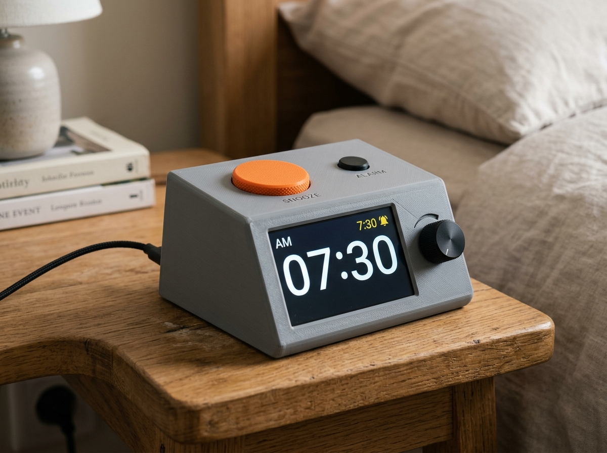

# Dawn Dock

A USB-powered ESP32-S3 bedside clock that keeps time and alarms offline, syncs user-approved schedules from a phone or PC, dims for sleep, and remains useful without internet.

 

<video src="docs/Dawn_Dock_sits_between_a_basic.mp4" width="100%" controls></video>

## Overview

Dawn Dock sits between a basic alarm clock and a cloud-dependent smart display. Its core clock, alarm, snooze, brightness, and local setup functions work without an account or network. A companion app can transfer alarm schedules and calendar snapshots over the local network or BLE; optional weather and calendar refreshes are additive, never prerequisites for waking.

## Motivation

Traditional alarm clocks are dependable but tedious to configure. Smart displays are convenient but can depend on vendor accounts, internet services, microphones, and opaque data handling. Dawn Dock aims for a repairable middle path: physical controls, a calm night display, RTC-backed timekeeping, explicit sync, and documented offline behavior.

## Target users

- People who want a bedside clock without a cloud account or always-listening microphone.
- Shift workers, students, caregivers, and households with changing but non-critical routines.
- Makers who want an approachable ESP32-S3 and KiCad project with modular bring-up.
- Privacy-conscious users who want to own, inspect, back up, and export alarm data.

Dawn Dock is a convenience appliance, not a life-safety or medical device. Users must not rely on it for medication, emergency response, transportation safety, or any situation where a missed alarm could cause serious harm.

## Concrete use cases

1. Set recurring weekday alarms on the device with a rotary control and dedicated buttons.
2. Prepare a week of alarms on a phone or computer, review a diff, and explicitly sync it to the clock.
3. Import selected events from an `.ics` file and turn them into alarm suggestions that require confirmation.
4. Dim the screen manually or with an ambient-light rule while retaining a one-press brightness override.
5. Lose Wi-Fi overnight and still get the stored alarm from RTC-backed local state.
6. Export alarms, settings, and a redacted event snapshot as portable JSON.

## Intended workflow

1. Assemble the ESP32-S3 display module, low-voltage carrier board, controls, sensor, and enclosure.
2. Flash firmware over USB and complete first-run setup locally.
3. Set time from the companion app, USB serial, or network time; the RTC maintains time across normal power interruptions.
4. Create alarms on-device or in the companion app. Calendar-derived alarms are previews until accepted.
5. Review the device/app sync summary, transfer the schedule, and verify the next alarm on the clock face.
6. Use physical snooze, alarm-dismiss, brightness, and menu controls without opening the app.
7. Export or restore user-owned configuration when moving devices.

## MVP features

- RTC-backed local time, timezone, DST rules, and deterministic recurring alarms.
- 3.5-inch readable clock face with manual and ambient-light-aware dimming.
- Dedicated snooze and brightness controls plus a rotary menu control.
- Locally stored alarms with clear next-alarm and sync-state indicators.
- Local-only companion setup/sync, schedule preview, JSON backup, and `.ics` import.
- Versioned, authenticated local protocol with no required cloud account.
- Repeatable firmware/app builds and hardware-in-the-loop test points as the project matures.

## Non-goals

- No voice assistant, microphone monitoring, advertising, or remote cloud dashboard.
- No automatic alarm creation from calendar events without user confirmation.
- No news feed in the MVP; weather is optional and must fail quietly when offline.
- No battery operation beyond RTC backup in the first revision.
- No mains circuitry, custom AC adapter, medical claims, emergency alerts, or guaranteed wake-up claim.
- No attempt to compete with tablets or general-purpose smart displays.

## Hardware direction

The module-first prototype uses a Waveshare ESP32-S3 3.5-inch touch-display development board as the controller/display candidate, with a low-complexity KiCad carrier for tactile controls, ambient-light sensing, audio connection, power/test access, and mounting. The candidate is not yet validated or locked. Manufacturer documentation and datasheets will be reviewed before schematic capture.

The planned editable design tree is:

```text
hardware/kicad/dawn-dock.kicad_pro
hardware/kicad/dawn-dock.kicad_sch
hardware/kicad/dawn-dock.kicad_pcb
```

Those KiCad files do **not** exist yet. They must be real editable sources, pass documented ERC/DRC review, and remain the design source of truth. Image exports and PDFs may supplement but never replace them.

Final BOM data belongs in KiCad schematic symbol properties (`Manufacturer`, `MPN`, supplier fields, notes) and is exported to `bom/bom.csv`. The current `bom/preliminary-bom.csv` is planning input only and must not be treated as validated purchasing data.

## Privacy, permissions, and storage

- Device schedules and settings remain in local flash; the companion stores its local copy on the user's device.
- No account or telemetry is required. Network discovery and calendar/file access are requested only when the user invokes those workflows.
- Calendar import is file-based or user-selected; the MVP does not request broad calendar access by default.
- Sync is limited to the local network or BLE, uses an explicit pairing step, and presents changes before applying them.
- Backup/export uses documented JSON; calendar import uses `.ics`. Users can delete device/app state.
- Optional external data such as weather must be opt-in, disclose the contacted endpoint, and never affect alarm execution.

## Safety limits

- USB 5 V SELV power only; no mains wiring or charger design.
- Use a certified, enclosed USB power supply. Do not operate damaged cables or exposed assemblies unattended.
- RTC coin-cell support, if used, must follow the holder and cell manufacturer's polarity, chemistry, and charging restrictions.
- Audio output must be volume-limited and verified; the prototype is not a hearing or emergency alert device.
- Bench, simulation, and static-analysis results must be labeled separately. An unbuilt prototype is never described as physically tested.

## Current status and milestones

**Status: concept and documentation scaffold only.** No schematic, PCB, production BOM, firmware, companion app, ERC/DRC report, fabrication output, enclosure, or physical test result exists yet.

1. Freeze measurable requirements and perform risk review.
2. Validate module/components against manufacturer documentation and create the KiCad source/BOM.
3. Build and verify the carrier PCB and firmware clock/alarm core.
4. Build the local-first companion and protocol.
5. Integrate, assemble, measure, troubleshoot, and publish fabrication/release evidence.

See [PLAN.md](PLAN.md), [hardware/requirements.md](hardware/requirements.md), and the issue backlog.

## Development quickstart

The repository is documentation-only today. Planned tools:

- KiCad 9 or newer for editable schematic/PCB work and ERC/DRC.
- ESP-IDF 5.x with CMake/Ninja for firmware.
- Flutter stable for Android, iOS, Windows, and macOS companion targets.
- Python 3 for protocol fixtures and hardware-independent integration tests.

Once skeletons land, exact bootstrap commands and pinned versions will be recorded here. Until then, there is no honest build command to run.
