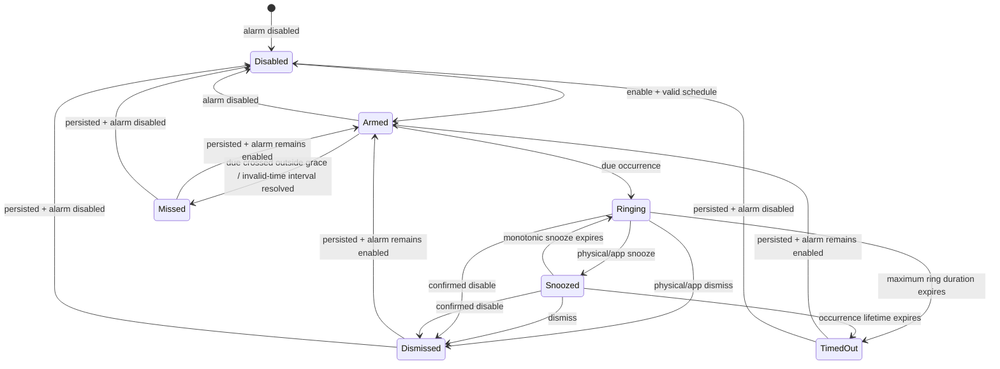

# Deterministic alarm semantics

**Baseline:** v0.1
**Evidence status:** normative behavior specification with partial host software-test coverage in `firmware/host`; occurrence lifecycle, committed-snapshot UTC occurrence evaluation, race-safe dual-slot schedule/runtime-journal storage, and pure weekly recurrence against supplied versioned timezone transitions are covered. A complete pinned IANA rule-data adapter, recurrence-to-snapshot integration, invalid-time reconciliation, target execution, and bench evidence remain open.

## Principles

1. A committed alarm executes locally without app, Wi-Fi, BLE, weather, or cloud service.
2. A single scheduled occurrence is admitted and journaled at most once. Its existing alert output may resume once after a stable reboot, but reboot or backward wall-clock correction never creates a second occurrence.
3. Wall time chooses an occurrence; monotonic time controls an active ring/snooze interval so ordinary clock corrections do not stretch or shorten it.
4. Every externally visible transition has a durable reason and timestamp-quality marker.
5. Invalid RTC/time state is explicit. The device never invents trustworthy time or silently claims an alarm occurred.

## State model

`Dismissed`, `TimedOut`, and `Missed` are durable terminal outcomes for one occurrence. If the alarm definition remains enabled, it then returns to `Armed` for its next occurrence. Disabling an active alarm is a confirmed dismiss action with terminal reason `alarmDisabled`; only after that record is persisted does the alarm definition enter `Disabled`.

## State definitions

| State | Meaning | Required durable data |
|---|---|---|
| `Disabled` | Alarm definition exists but cannot generate occurrences | alarm ID, schedule revision, enabled=false |
| `Armed` | Enabled alarm has a calculable next occurrence | next candidate, timezone/rule version, schedule revision |
| `Ringing` | Audio/visual alarm is active | occurrence ID, scheduled UTC instant, actual start, attempt count |
| `Snoozed` | Audio is paused until a monotonic deadline | occurrence ID, snooze count, monotonic duration and reboot-recovery wall deadline |
| `Dismissed` | User intentionally ended this occurrence | terminal reason, action source, time quality |
| `TimedOut` | Maximum configured occurrence lifetime ended without dismissal | terminal reason and elapsed duration |
| `Missed` | The due instant passed without entering `Ringing`, or an already-active alert was interrupted by power loss until its lifetime expired | cause: forward jump, invalid time, prolonged power-off, evaluator unavailable, recovery outside grace, or power loss after ring start |

## Occurrence identity and duplicate prevention

An occurrence ID is derived from the alarm UUID, committed schedule revision, and resolved scheduled UTC instant. It is not derived only from local clock text. The occurrence journal stores at least active and recent terminal IDs before side effects are acknowledged.

Before entering `Ringing`, the evaluator atomically checks that the occurrence ID is neither active nor terminal, then marks it active. An already-active ID is handled only by the explicit reboot-recovery path; it is never admitted as a new occurrence or given a second journal record. A backward clock correction or DST fold therefore cannot retrigger the same resolved instant. Applying a new schedule revision may create a new future occurrence, but it may not revive a terminal occurrence unless the user explicitly creates a distinct alarm.

## Recurrence and timezone rules

- Alarm definitions use an IANA timezone name and local time. Firmware carries a pinned timezone-rule data version; the app shows that version during preview.
- Weekday recurrence uses the alarm's local calendar date, not UTC weekday.
- **Spring gap:** if a requested local time does not exist, schedule it once at the earliest valid local instant after the gap on that date and label the preview/receipt `shiftedForGap=true`.
- **Fall fold:** if a local time occurs twice, ring once at the **first** occurrence by default. Preview shows the ambiguity. A later protocol version may support an explicit second-fold policy, but v1 does not infer one.
- A timezone database update recomputes only future, non-active occurrences. It cannot alter a terminal occurrence journal entry.
- Manual timezone changes require a preview of the next occurrence before apply.

## Time corrections

| Event | Required behavior |
|---|---|
| Small correction before due time | Recompute future due instant; do not change active monotonic timers |
| Backward correction | Never replay a journaled occurrence; recompute future unjournaled occurrences |
| Forward correction crossing a due instant by **10 minutes or less** | Ring once immediately as `late`, record lateness |
| Forward correction crossing a due instant by more than 10 minutes | Record `Missed`; do not surprise the user with a stale alarm |
| RTC becomes invalid | Freeze scheduled transitions, show a persistent invalid-time diagnostic, preserve schedules, and continue local controls |
| Time becomes valid after an invalid interval | Reconcile all crossed occurrences: ring only the newest one within the 10-minute grace; mark older ones missed |
| User manually sets time | Require explicit confirmation and show affected next alarm; apply the same forward/backward rules |

The 10-minute late-ring grace is a frozen MVP policy and must have boundary tests at 9:59, 10:00, and 10:01.

## Ring, snooze, dismiss, and timeout

- Default snooze duration is 9 minutes; allowed configured range is 1–30 minutes.
- Maximum consecutive snoozes is 6. A seventh snooze request is rejected accessibly while ringing continues.
- Maximum occurrence lifetime is 60 minutes from first ring, including snooze intervals. At expiry, transition to `TimedOut`.
- Physical snooze and dismiss work with radios disabled and take priority over app requests.
- Duplicate button edges within the debounced gesture may produce only one transition.
- An authenticated app may request snooze/dismiss only for the active occurrence ID. Stale IDs return a stable conflict error.
- Audio-start failure does not create a separate state transition: the visual `Ringing` state remains active, diagnostics record `audioFailed=true`, and an uninterrupted powered occurrence ends as `Dismissed` or `TimedOut`. `Missed` is used only when an occurrence could not enter `Ringing` or when power loss interrupted an active occurrence through the end of its lifetime.

## Reboot and power-loss recovery

On boot, load and validate the last-known-good schedule, occurrence journal, RTC validity, and reset cause before normal evaluation.

1. If an occurrence was `Ringing` or `Snoozed` and its 60-minute lifetime has not expired, resume `Ringing` once and mark `recoveredAfterReboot=true`. Reboot intentionally cancels the remaining snooze interval; this must be shown in diagnostics and tested.
2. If that lifetime expired while power was absent, record `Missed` (not `TimedOut`, because no active alert was available).
3. If power was absent across several occurrences, only the newest occurrence within the 10-minute grace may ring; older occurrences become `Missed`.
4. If storage validation fails, roll back to the last-known-good committed schedule, surface a fault, and never apply a partial update.
5. An active occurrence uses the recovery path rather than normal admission. After power is stable, recovery may resume audio once for that boot without creating another occurrence record; reset-loop holdoff prevents repeated startup chirps before stability is established.

## Schedule updates and conflicts

- Preview is side-effect free.
- Apply requires authentication, accepted preview content, and `expectedRevision == currentRevision`.
- Apply writes the complete new schedule atomically. Partial alarm updates are not visible to the evaluator.
- If an apply races with a due occurrence, the evaluator uses the last fully committed revision. The receipt identifies the revision that owns the occurrence.
- A revision conflict returns the current revision and requires a fresh preview. No last-write-wins behavior is allowed.
- Calendar-derived records remain drafts in the app until the user confirms them; import alone cannot arm an alarm.

## Required test matrix

Host fixtures must cover every state transition plus:

- recurrence across month/year boundaries;
- spring gap and fall fold for at least two IANA zones;
- corrections at the 10-minute grace boundaries;
- reboot in `Armed`, `Ringing`, and `Snoozed`;
- confirmed disable during `Ringing`/`Snoozed` and disable immediately after every terminal outcome;
- power restoration inside/outside the occurrence lifetime;
- 100 controlled power cycles with no duplicate occurrence or schedule loss;
- duplicate control edges and stale app occurrence IDs;
- revision conflict while an occurrence becomes due;
- invalid RTC becoming valid with zero, one, and multiple crossed occurrences;
- corrupted primary storage with successful last-known-good rollback;
- radio loss throughout ring/snooze/dismiss.

Passing host fixtures is static/software test evidence. Power-cycle, RTC, audio, and radio-loss behavior require bench evidence before any physical-performance claim.
