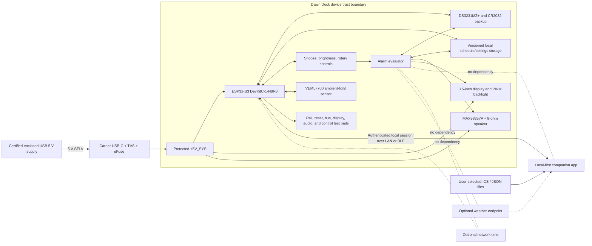

# Dawn Dock system architecture baseline

**Baseline:** v0.1
**Scope:** MVP architecture and measurable design constraints
**Evidence status:** requirements and allocations only; no physical performance is claimed

This document is normative for downstream component selection, schematic capture, firmware, companion-app, enclosure, and verification work. If a later design cannot meet a requirement, record the change and its risk impact before implementation. Manufacturer documentation and measured prototypes remain the authority for component capability.

## Safety and product boundary

Dawn Dock is a USB 5 V SELV-powered convenience alarm clock. It is not medical equipment, an emergency notifier, a smoke/CO/security alarm, or a guaranteed wake-up device. It must not switch or contain mains voltage. Optional network features may improve setup but may not participate in the alarm-critical execution path.

## Editable block diagram

The Mermaid source above is the diagram source; generated images are supplementary only.

## Responsibility boundaries

| Boundary | Owns | Must not own |
|---|---|---|
| Alarm evaluator | occurrence calculation, durable occurrence IDs, ring/snooze/dismiss/timeout transitions, missed-event classification | network discovery, calendar parsing, weather, app availability |
| Time service | RTC/system/monotonic time, timezone rules, validity and quality state, correction events | schedule mutation |
| Device storage | versioned atomic schedule/settings records, occurrence journal, rollback/recovery | imported event descriptions, attendees, or unrelated calendar data |
| Hardware abstraction | RTC, controls, display/backlight, audio, storage and transport adapters | alarm policy |
| Transport service | authenticated pairing/session, bounded parsing, revision checks, preview/apply, receipts | direct writes to alarm storage or blocking alarm evaluation |
| Companion app | local drafts, selected-file import, ambiguity display, explicit confirmation, backup/export, protocol client | automatic unreviewed alarm creation, remote/cloud dependency |
| Carrier PCB | protected low-voltage interconnect, controls, sensor, audio path, mounting, test access | mains conversion, undocumented back-powering, unverified module assumptions |
| Enclosure | stability, access, strain relief, light/audio paths, serviceability | electrical safety claims beyond the validated assembly |

## Alarm-critical dependency rule

The alarm evaluator, committed schedule, valid time source, local controls, display status, and audio path form the alarm-critical core. Radio tasks, pairing, app sync, calendar import, weather, and update checks are optional services. They must communicate with the core through bounded queues or atomic repositories and must fail closed for writes without delaying alarm evaluation.

## Preliminary 5 V power allocation

This is a **design envelope**, not a measurement or a pass. The Rev A schematic now captures the eFuse limit/ramp calculations; bring-up must still measure idle, inrush, and simultaneous display/radio/audio peaks on identified hardware.

| Load/reserve | Worst-case allocation at 5 V | Basis and required follow-up |
|---|---:|---|
| ESP32-S3 DevKitC-1 and radios | 450 mA | Conservative planning allocation; verify Wi-Fi/BLE transmit and application peak on the received N8R8 board |
| Display and backlight | 200 mA | Manufacturer does not publish a full-white module maximum; measure at maximum permitted brightness |
| MAX98357A audio path | 350 mA | Firmware-capped planning allocation into the selected 8-ohm speaker; verify alarm transient, SPL, distortion, and temperature |
| RTC, sensor, controls, and indicators | 50 mA | Replace with schematic maximum-current sum |
| Inrush and engineering margin | 450 mA | Reserved; verify connector insertion, eFuse ramp, bulk capacitance, and simultaneous subsystem transitions |
| **Total design peak** | **1,500 mA (7.5 W)** | Expected steady/transient load excluding reserved margin must remain at or below 1,125 mA for at least 25% source headroom |

Power decisions:

- Use a certified enclosed 5 V supply rated at **at least 2 A**; the US planning selection is Raspberry Pi `SC0218` (5.1 V, 3 A).
- Use a power-only GCT `USB4105-GF-A` input with independent 5.1 kΩ CC resistors, LRC `LESD8LH5.0CT5G` VBUS TVS, and TI `TPS259531DSGR` eFuse.
- Use Yageo `RC0603FR-071K53L` (1.53 kΩ, 1%) at ILM. TI SLVSE57C equation 4 gives about 1.347 A nominal; a conservative combination of +7.5% current-limit error and -1% resistor tolerance is about 1.463 A, below the 1.5 A ceiling. The schematic also uses 100 nF at dVdt (about 0.42 V/ms and 11.9 ms to 5 V); received module capacitance and inrush remain bench gates.
- Feed the DevKit 5 V header from the protected rail. The official v1.1 schematic's USB Schottky is the anti-backfeed boundary; unverified clone boards are not substitutions.
- Rate connector, protection path, and carrier copper for the 1.5 A ceiling and verify the eFuse exposed-pad thermal implementation.
- Bench acceptance measures input voltage, each generated rail, idle current, peak current with display + radios + maximum permitted audio active, inrush, and reset/brownout recovery.
- Any measured peak above 1.5 A is a design-review blocker rather than a reason to silently increase the limit.

## Frozen MVP targets

These are release gates unless explicitly marked as an open decision.

| Area | Requirement |
|---|---|
| Display | Manual blackout without disabling alarms. Lowest non-black setting target is no more than 1 cd/m² measured normal to the display in a dark room; if the selected module cannot meet it, change the module or add hardware backlight control. Display remains legible at typical bedside distance; exact daylight luminance is an open decision pending module measurement. |
| Acoustic | Adjustable output. Target 60–75 dBA at 1 m for the selectable normal range; software/hardware maximum target no more than 80 dBA at 1 m. Measure A-weighted slow response in the final enclosure. This is a convenience alert, not a wake guarantee. |
| Controls | Dedicated tactile snooze and brightness controls plus rotary navigation. A valid press is acted on within 100 ms under normal load; debounce rejects bounce without duplicate action. Snooze is identifiable by touch, and a 10 N press must not tip the unit. |
| Offline behavior | With radios disabled, clock, committed alarms, ring/snooze/dismiss, brightness, menu, and diagnostics remain available. A 72 h bench fixture with representative alarms is the MVP integration gate; longer field testing is reported separately. |
| RTC retention | Maintain valid time for at least 24 h without main power, then report drift over the measured interval. Rev A selects DS3231MZ+ with a replaceable non-rechargeable CR2032 and no charge path; the requirement remains open until bench measurement. |
| Power-cycle persistence | Preserve a valid committed schedule and prevent duplicate occurrences through 100 controlled power cycles. |
| Enclosure | Maximum 140 × 100 × 75 mm excluding cable; serviceable with common hand tools, strain-relieved USB entry, no destructive adhesive on primary service items, and no tipping under the 10 N snooze test. |
| Environment | Indoor 10–35 °C, non-condensing. User-accessible surface-temperature limit is an open decision until materials and thermal measurements are available; no release claim is allowed without the 35 °C ambient worst-case test. |
| Accessibility | Non-color-only states, screen-reader labels in the app, logical keyboard/focus order, reduced-motion support, text scaling to 200%, minimum 48 × 48 logical-pixel app targets, high-contrast clock mode, and tactile primary device controls. Text contrast target is WCAG 2.2 AA (4.5:1 normal, 3:1 large text). |
| Privacy | No account, telemetry, microphone, camera, contacts, or broad calendar permission. File access is user-invoked. Retain only accepted alarm fields and minimal provenance; support local export and erase. |
| Cost | Target remains USD 75 excluding the user's phone/computer and maker tools. The 2026-08-23 Rev A planning subtotal is about USD 87 before tax/shipping; the documented overage accepts microphone-free hardware, RTC backup, protected input, and independent audio. Re-price and reduce cost before purchase without removing those constraints. |
| Safety | USB 5 V SELV only; no mains, medical, emergency, life-safety, or guaranteed-wake claims. |

## Time, storage, and update architecture

- Store schedules with a schema version, monotonically increasing revision, integrity check, and last-known-good copy.
- Preview normalizes and validates a candidate schedule without changing the committed revision. Apply is authenticated, compares the expected revision, writes atomically, re-reads/validates, and returns a receipt.
- Persist terminal occurrence records before acknowledging dismiss/timeout. Keep enough journal history to cover timezone corrections and reboot recovery without unbounded growth.
- Treat RTC validity and timezone-rule version as visible diagnostics. Invalid time must never be presented as trustworthy.
- Firmware update/recovery is subordinate to local USB recovery and rollback. An update may not silently erase the committed schedule.

## Open architecture decisions and gates

| Decision | Why open | Gate that closes it |
|---|---|---|
| Rev A received-unit and mechanical confirmation | Component identities/pin allocation are selected, but exact received revisions, display connector orientation, mounting geometry, and antenna clearance are not physically confirmed | Issue #3 schematic can proceed; PCB outline/enclosure/fabrication wait for CAD drawing or receipt measurement |
| Component-level current and thermal limits | Planning envelope is not a source-backed maximum-current sum or measurement | Issue #3 datasheet calculations followed by full-load/inrush and 35 °C bench tests |
| Prototype cost reduction | 2026-08-23 planning subtotal is about USD 87 before tax/shipping | Re-quote and reduce by at least USD 12 without adding a microphone or removing RTC/input protection |
| Primary local transport | LAN and BLE have different provisioning/accessibility constraints | Threat-model spike and protocol fixture interoperability in issues #5/#6 |
| User-accessible surface-temperature limit | Depends on enclosure material, contact duration, and thermal design | Material selection and measured 35 °C ambient thermal review |
| Daylight luminance target | Display capability and user context are unmeasured | First optical characterization and usability review |

## Change control

A downstream PR that changes a frozen target must update this document, `hardware/requirements.md`, the verification matrix, and affected risks. The PR must state whether evidence is static analysis, simulation, bench test, or field test. Absence of bench hardware is a disclosed evidence gap, not a pass.
